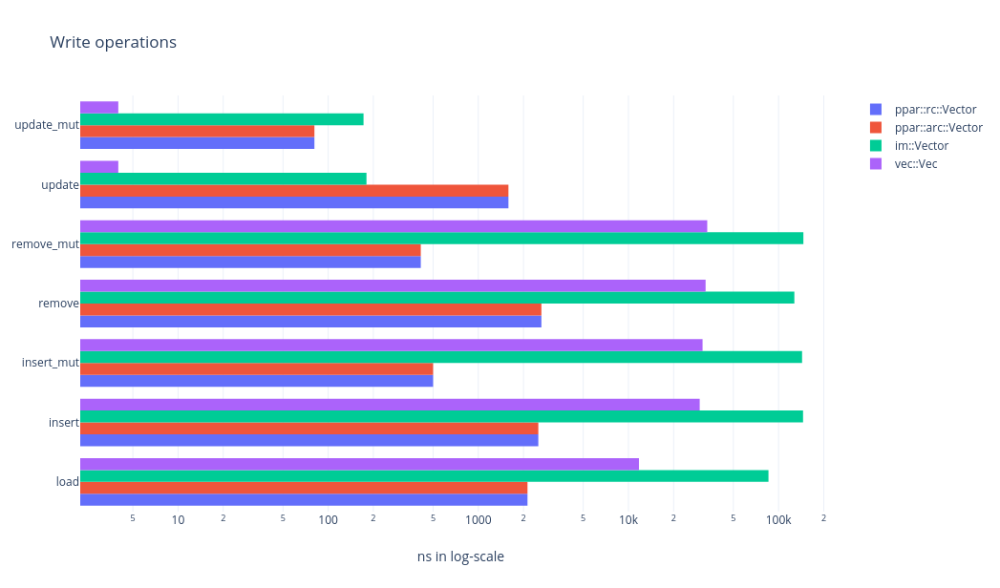

[](https://docs.rs/ppar)

Package implement persistent array using a variant of rope data structure.

Why would you want it ?
-----------------------

Array is implemented as [std::vec][std_vec] in rust-standard library.
For most cases that should be fine. But when we start working with arrays
that are super-large and/or step into requirements like  non-destructive
writes and concurrent access, we find [std::vec][std_vec] insufficient.
[im][im] is a popular alternative, but has `insert()` and `delete()`
penalties similar to `std::vec` for large arrays. While most implementation
prefer to use [RRB-Tree][rrb], `ppar` is based on [Rope data structure][rope].

Here is a quick list of situation that might require using `ppar`.

* When array size is too large with repeated insert and remove operation.
* When shared ownership is required.
* When shared ownership across concurrent threads.
* To support undo/redo operation for array modifications.
* When splitting up of array and/or joining arrays are frequently done.
* Lazy clone of array using copy-on-write.

**Check out our [performance metric](#performance-metric)**

Algorithm
---------

Fundamentally, it can be viewed as a binary-tree of array-blocks, where
each leaf-node is a contiguous-block of type `T` items, while intermediate
nodes only hold references to the child nodes - `left` and `right`.
To be more precise, intermediate nodes in the tree are organised similar
to rope structure, as a tuple of `(weight, left, right)` where weight is
the sum of all items present in the leaf-nodes under the left-branch.

A list of alternatives can be found [here](#alternate-solutions). If you
find good alternatives please add it to the list and raise a PR.

If you are planning to use `ppar` for your project, do let us know.

Goals
-----

- [x] Vector parametrized over type T.
- [x] Immutable / Persistent collection of Vector<T>.
- [x] CRUD operation, get(), set(), delete(), insert(), all are persistent.
- [x] Convert from Vec<T> to ppar::Vector<T>.
- [x] Convert from ppar::Vector<T> to Vec<T>.
- [x] Thread safe operations.
- [x] [std::vec::Vec][std_vector] like mutable API.
- [ ] Iteration over collection, item-wise, chunk-wise, reverse.
- [ ] Deduplication.
- [ ] Membership.
- [x] Joining collections, splitting into collections.
- [ ] Partial collection.
- [ ] Extending collection.
- [ ] Queue operations, like pop(), push().
- [ ] Functional ops, like filter, map, reduce.
- [ ] Sort and search operations.
- [ ] Trait implementations.
  - [x] Clone
  - [ ] Eq, PartialEq, Ord, PartialOrd
  - [ ] Extend
  - [ ] From, FromIterator, IntoIterator
  - [ ] Hash
  - [ ] Index, IndexMut
  - [ ] Write
- [ ] Parallel iteration with [rayon][rayon].
- [x] Fuzzy tested.

The basic algorithm is fairly tight. Contributions are welcome to make the
`ppar::Vector` type as rich as [std::vec::Vec][std_vector] and
[im::Vector][im_vector].

Contributions
-------------

* Simple workflow. Fork, modify and raise a pull request.
* Before making a PR,
  * execute `check.sh` to pass unit-testing and fuzzy testing.
  * execute `perf.sh` for performance report.
* [Developer certificate of origin][dco] is preferred.

Performance metric
------------------

On a 2008 core2-duo machine with 8GB RAM. The measurements are taken using
the following command and all the numbers are **op** Vs **latency**.

```bash
cargo run --release --bin perf --features=perf -- --load 100000 --ops 10000
```


<sup>Lower numbers are better</sup>

<sup>Lower number are better</sup>

We are loading the array with an initial data set of `100_000` u64 numbers.
Then applying each operation in a tight loop, measuring the elapsed time
for the entire loop and finally computing per-op latency. `insert`,
`insert_mut`, `remove`, `remove_mut`, `update`, `update_mut`, and `get` use
random offset into the array. For iteration, we compute the elapsed time
for iterating each item.

* Using the logarithm scale implies an order-of-magniture difference in
  performance.
* Between `arc` and `rc` variant of `ppar`, performance difference is not much.
  Though it might make a difference for cache-optimized algorithms.
* `ppar` gains order-of-magniture improvent over `vec` and `im` for **insert**,
  **remove**, **load**, **split**, **append**, **clone** operations.
* And it falls behind on **update**, **get**, **iter** operations. But it may
  be worth noting that where-ever it falls behind it is still on the lower end
  of the log-scale, that is, the difference is well within 100ns.

It is also worth noting that, maximum size of the operated data-set is less
than 2MB, which means the entire array footprint can be held inside the
CPU cache. As far as my understanding goes, when we increase the size of the
array, the performance difference will only be more pronounced, that is, fast-op
might look faster and slow-op might look slower.

Alternate solutions
-------------------

* [im][im]
* [rpds][rpds]

[im]: https://github.com/bodil/im-rs
[im_vector]: https://docs.rs/im/15.0.0/im/struct.Vector.html
[rope]: https://en.wikipedia.org/wiki/Rope_(data_structure)
[rpds]: https://github.com/orium/rpds
[std_vec]: https://doc.rust-lang.org/beta/std/vec/index.html
[std_vector]: https://doc.rust-lang.org/beta/std/vec/struct.Vec.html
[rrb]: https://infoscience.epfl.ch/record/213452/files/rrbvector.pdf
[rayon]: https://crates.io/crates/rayon
[quickcheck]: https://crates.io/crates/quickcheck
[dco]: https://developercertificate.org/
